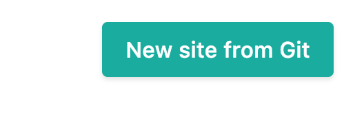
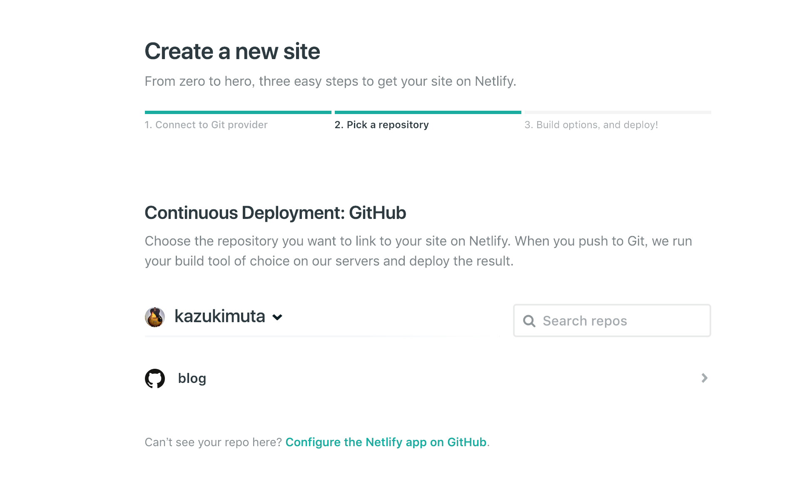
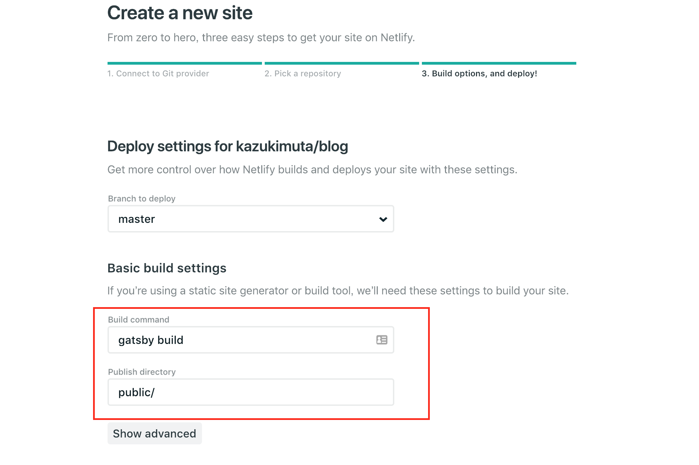
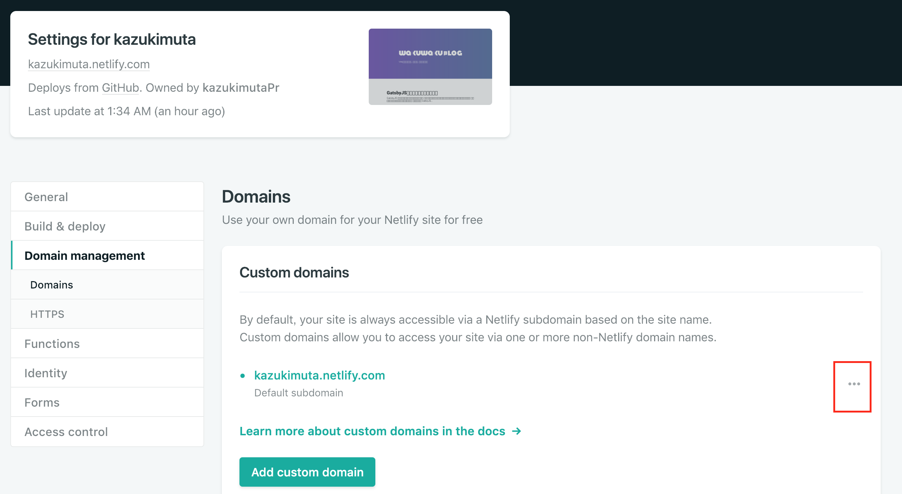
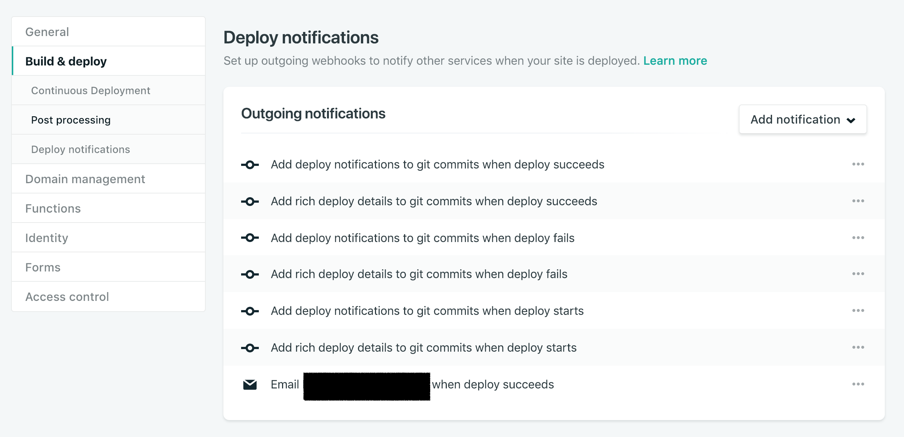

おおまかには以下の通り

- GatsbyJSに入門
- GatsbyJSでブログを作成
    - markdownで記事を書けるようにする
    - レイアウトやフォントをカスタマイズする
    - 記事のレイアウトをつくる
- Netlifyで公開する


# GatsbyJSに入門

[Tutorial](https://www.gatsbyjs.org/tutorial/)が非常に充実しているが、とりあえずローカルで動かしてみると理解が早いように思う。

```
# gatsby CLIを取得して
npm install --global gatsby-cli

# テンプレートから新規プロジェクトを作る
gatsby new new-blog # https://github.com/gatsbyjs/gatsby-starter-default をテンプレートとしてプロジェクトが作成される

# あとは動かす
cd new-blog && npm run develop
```

# GatsbyJSでブログを作成
## markdownで記事を書けるようにする

[ここ](https://www.gatsbyjs.org/docs/adding-markdown-pages/)と[ここ](https://www.gatsbyjs.org/docs/adding-a-list-of-markdown-blog-posts/)に沿って、markdownのページのテンプレートと、記事の一覧画面を作成するながれ。

この通りに進めれば、基本的な表示はおわり。

成果物は
- [markdownページのテンプレート](https://github.com/kazukimuta/blog/blob/master/src/templates/blogTemplate.js)
- 記事の一覧 [このあたり](https://github.com/kazukimuta/blog/tree/master/src/components/post)

## レイアウトやフォントをカスタマイズする
この部分が一番手間取った。markup力が弱いのが原因。

### スタイルの適用方法
Gatsbyでは[Typography.js](https://www.gatsbyjs.org/docs/typography-js/)というライブラリでスタイル管理することを押しているのだが、巷に落ちているスタイルを借用したかった([これとか](https://milligram.io/))ので、ひとまず素のCSSファイルをJSXモジュールにインポートすることにした。

```javascript
import React from 'react'
import './header.css'

export default Header = () => (
  <div className="header">
    <div className="siteHeading">
      <h1 className="blogTitle">ブログタイトル</h1>
    </div>
  </div>
)
```

header.css

```css
.header {
    width: 100%;
}
.siteHeading {
  color: white;
}
.siteHeading > h1 {
  font-size: 3em;
  line-height: 1.5;
  margin-bottom: 0.5em;
}
```

ひとまずこんな感じで実装した。

ただし、特定モジュールでインポートしていても結局スタイルのスコープはグローバルなので、
例えば他のJSXモジュールに`site-heading`というクラス名があると、その要素にもスタイル適用されしまう。

[CSS Modules](https://www.gatsbyjs.org/tutorial/part-two/#css-modules)を使って

```javascript
import React from 'react'
import styles from './header.css'  // highlight-line

export default Header = () => (
// highlight-start
  <div className={styles.header}>
    <div className={styles.siteHeading}>
      <h1 className={styles.blogTitle}>ブログタイトル</h1>
    </div>
  </div>
// highlight-end
)
```

のようにすると、スタイルの適用を限定できるっぽい。これは今後の課題

### フォント
メインのロゴ含め、GoogleFontを使用。

やったことは、[react-helmetでheaderを処理している箇所](https://github.com/kazukimuta/blog/blob/master/src/components/doc-header.js)に、GoogleFontのlinkタグを追加しただけ。
あとは、フォントを適用したい箇所に対し、↑で定義したCSSファイルでfontを指定


### ファビコンやデスクトップアイコン画像の差し替え

[gatsby-plugin-manifest](https://www.gatsbyjs.org/packages/gatsby-plugin-manifest)というプラグインが、manifestファイルとファビコン設定を同時に実施してくれる。
(gatsby-starter-defaultで起動している場合、すでに導入済み)

インストール後に、`gatsby-config.js`に以下のように設定すると、指定した画像を適切にリサイズしたうえで、manifestファイルとファビコンを仕込んでくれる

```javascript
module.exports = {
  plugins: [
    {
      resolve: `gatsby-plugin-manifest`,
      options: {
        name: `私のブログ`,
        short_name: `私のブログ`,
        start_url: `/`,
        background_color: `#663399`,
        theme_color: `#663399`,
        display: `minimal-ui`,
        icon: `src/images/icon.png`, // 画像ファイルのパス
      },
    },
  ],
}
```


## 記事のレイアウトをつくる
### prismjsを入れる
シンタックスハイライターの[prismjs](https://prismjs.com/)を入れた。

[プラグイン](https://www.gatsbyjs.org/packages/gatsby-remark-prismjs)があるので、記事に従って`gatsby-config.js`を修正すればおわり

### 画像ファイルを読み込む
これまた[プラグイン](https://www.gatsbyjs.org/packages/gatsby-remark-images/?=gatsby-remark-images)の指示に従って`gatsby-config.js`を修正すればおわり。

```
entries
└── 2019
    └── 01
        └── 05
            ├── howto-gatsby.md
            └── image.img
```

このようなフォルダ構成にすると、`howto-gatsby.md`で

```markdown

```

のようにファイルを読み込むことができる。

# Netlifyで公開する

今回一番感動した部分。
当初はgithub pagesを使ってホストするつもりだったが、code管理をgithubでやる上で少し不便だったので、Netlifyを使うことにした。
[Netlify](https://www.netlify.com/)を使うと、静的なサイトをすぐに無料公開することができる。

Githubのページと連携させておけば、Githubにコミットを見つけて、ビルド、デプロイを自動的に実施してくれる。
CircleCIなど使ってCI環境作るのかなと思っていたのだが、そんな手間は一切不要で、Netlifyにアカウント登録してから本当に数分でCIなサイトを公開することができた。

正直特に迷う所もないほど簡単に設定できるが、アカウント作成後の大まかな手順は

__1. [New site from Git]を選択__  


__2. 連携したいGitリポジトリを選択__  
Github, Gitlab, Bitbacketから選択。無料版は？パブリックリポジトリである必要あり


__3. ビルドの設定__  
`Branch to deloy`や`Build Command`、`Publish directory`を設定する。GatsbyJSのリポジトリの場合、初期状態で値を埋めてくれているので、そのまま次に進めばOK


__4. その他の設定__  
以上でベースの設定が終わるので、プロジェクトの設定ページで各種設定を行う。

- ドメイン設定
    - [Domain management] > [Domains] でサイトのドメインが確認できる。[・・・]から編集可能
    
- デプロイ後の通知
    - [Build & deploy] > [Post processing] より設定可能。メールやSlack通知など
    


# まとめ

- GatsbyJS + markdown + Netlifyでサーバーレス無料ブログが作れた
- 個人的に、GatsbyJSがReactJSベースなのでカスタマイズしやすい
- Netlifyは感動を覚えるほどの使い心地のよさ

