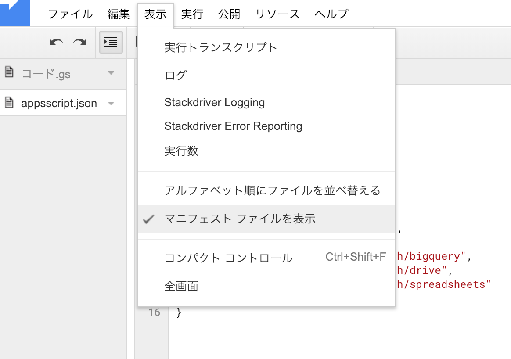
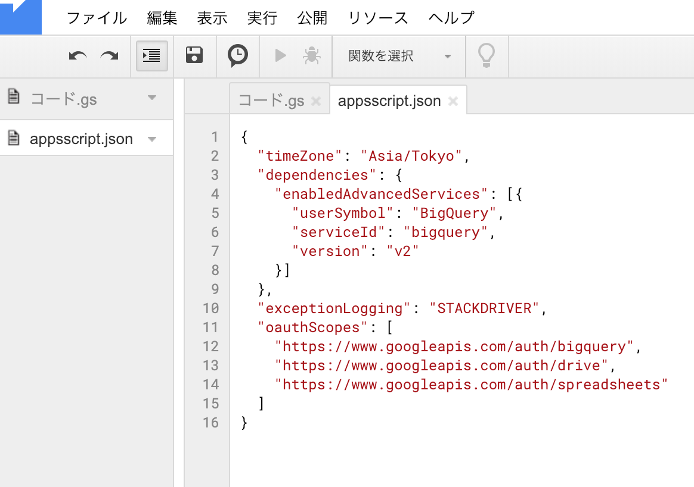

社内の諸々のデータを可視化する目的で、BigQueryにデータを蓄積し、Google SpreadSheetで直接可視化できるようにする営みを進めている。

このプロジェクトの中で、Google SpreadSheetに蓄積されたデータをBigQueryのソースデータとして利用したいという課題がでてきた。
つまり

```
SpreadSheet(外部データテーブル) <----> BigQuery <----> SpreadSheet/GAS(閲覧) 
```

という接続構成。


SpreadSheetを外部データテーブルとして接続するのはとても簡単で([ここ](https://ex-ture.com/blog/2018/06/24/google-apps-script-to-update-bigquery/)とか)、
SpreadSheet/GASからBigQueryへのアクセスも、[すごく使い勝手の良いコードがあり](http://toreta.blog.jp/archives/20649904.html)、それぞれの接続は簡単にできたのだが、
`SpreadSheet <-> BigQuery <-> SpreadSheet` の接続構成を取ると、
```
Access Denied: BigQuery BigQuery: No OAuth token with Google Drive scope was found.
```
というエラーが生じてしまい、ハマった。

# 問題は、GoogleAppScriptのデフォルトのScope

https://github.com/googleapis/google-cloud-python/issues/3067

BigQueryクライアントのデフォルトスコープにGoogleDriveが含まれていないというISSUEがあった。
このリポジトリ自体はPythonのライブラリのもので、後述するGASで個別にスコープ設定する書き方がわからなかったのもあり、
はじめにこのISSUE見たときはスルーしていたのだけど、最終的にはこれが参考になった。

# 解決方法

1. GASのメニューで [表示] > [マニュフェストファイルを表示] で、`appscript.json`を表示する


2. マニュフェストに、以下の`oauthScopes`設定を追加

```
{
 ...
  "oauthScopes": [
    "https://www.googleapis.com/auth/bigquery",
    "https://www.googleapis.com/auth/drive",
    "https://www.googleapis.com/auth/spreadsheets"
  ]
}
```



# 所感

BigQuery側の設定や、SpreadSheetの共有設定など、色々疑ってだいぶハマってしまったけど、
最終的に解決できて一安心。
