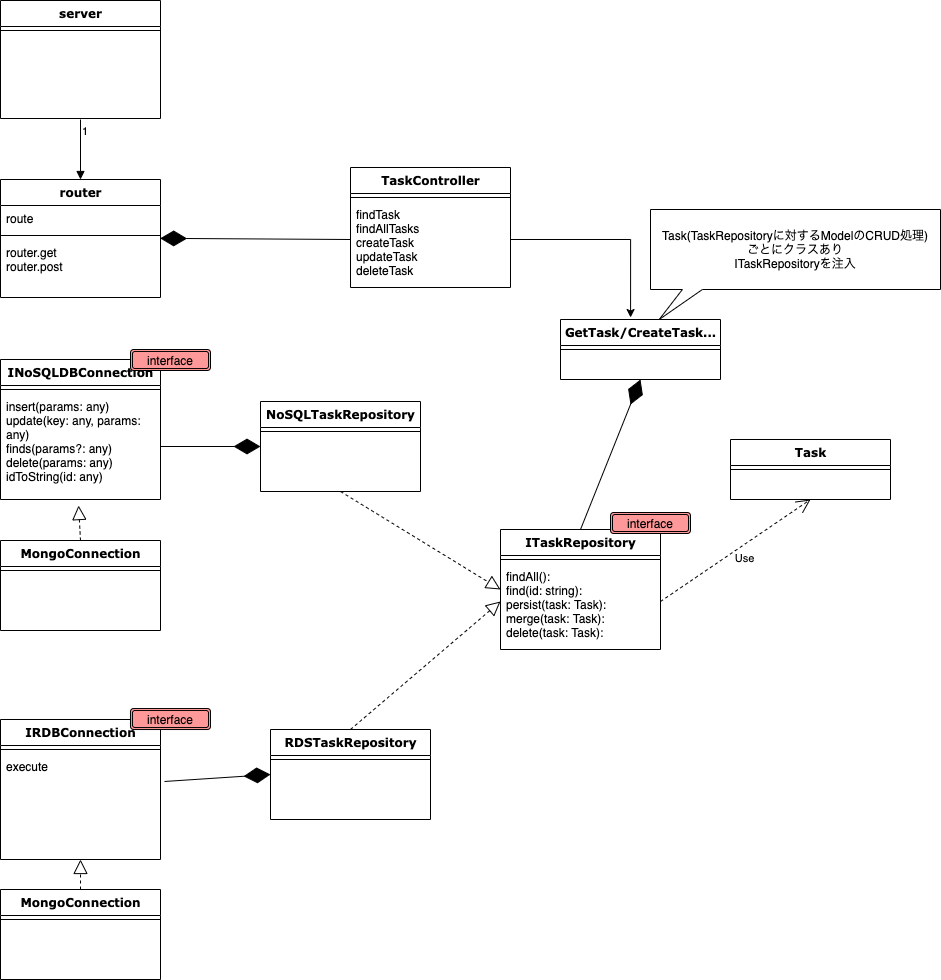

<!-- TOC -->

- [1. 背景](#1-背景)
- [2. つくったもの](#2-つくったもの)
- [3. 構成](#3-構成)
- [4. 所管](#4-所管)
    - [4.1. Dependency Injection(DI)の効用](#41-dependency-injectiondiの効用)
    - [4.2. DIのとき、どこでインスタンスを作るべきかになやむ](#42-diのときどこでインスタンスを作るべきかになやむ)
    - [4.3. Application Business RulesとEnterprise Business Rulesの違い](#43-application-business-rulesとenterprise-business-rulesの違い)
- [5. まとめ](#5-まとめ)

<!-- /TOC -->

<a id="markdown-1-背景" name="1-背景"></a>
# 1. 背景

Clean Architectureについて学びたく、TypeScriptでClean ArchitectureなWEBサーバーを実装してみました。
なお、本記事は[こちらのスペースマーケット社](https://blog.spacemarket.com/code/clean-architecture-node/)の記事を大いに参考にしています。ありがとうございます。


<a id="markdown-2-つくったもの" name="2-つくったもの"></a>
# 2. つくったもの

TypeScript x ExpressのWEBサーバー。クライアントは実装していません。
DBは（システム開発の現場ではそうそうないでしょうか）RDB(MySQL)とDocumentDB(MongoDB)を差し替え可能なようにしてみました。

[ソースコードこちら](https://github.com/kazukimuta/try_crean_architecture)

<a id="markdown-3-構成" name="3-構成"></a>
# 3. 構成

クラス構成は以下のような形です。
※ ところどころ端折っています



Clean Architectureの図とは対応づけは以下のような形です。

- Framework&Drivers
    - `server` : Expressのエントリポイント
    - `router` : Expressのrouter
    - `MongoConnection`, `MySQLConnection` : DBコネクタの実態
- Interface Adaptor
    - `RDSTaskRepository`, `NoSQLTaskRepository` : DBコネクタを操作する実態
    - `TaskController` : いわゆるコントローラ(MVCのC)。ただしExpressのrouter実態とは切り離している
    - `IRDBConnection`, `INoSQLDBConnection` :  各種DCConnectionのインターフェース
- Application Business Rules
    - `GetTask,,` : データモデルに対してCRUD操作を実施するサービスクラス。ほかにも色々なクラスがあるが記載割愛
    - `ITaskRepository` : TaskRepositoryのインターフェース。上記サービスクラスは、このインターフェース越しにCRUD操作する
- Enterprise Business Rules
    - `Task` : データモデル.今回はタスク管理サービスをイメージしたもの


<a id="markdown-4-所管" name="4-所管"></a>
# 4. 所管
<a id="markdown-41-dependency-injectiondiの効用" name="41-dependency-injectiondiの効用"></a>
## 4.1. Dependency Injection(DI)の効用

`GetTask`などのサービスクラスが直接DBオブジェクトを操作するのでなく、`ITaskRepository`経由でDBを操作するため、RDBであれDocumentDBであれ、`ITaskRepository`インターフェースをもつ操作オブジェクトを実装すれば差し替え可能です。

また、`DBConnection`についてもインターフェースを挟んでいることで、例えばテスト実行時にはモックに差し替えるといった切り替えをすることができます。

インターフェースに依存させることで、テスト容易性や移植性の向上に寄与するイメージがわきました。


<a id="markdown-42-diのときどこでインスタンスを作るべきかになやむ" name="42-diのときどこでインスタンスを作るべきかになやむ"></a>
## 4.2. DIのとき、どこでインスタンスを作るべきかになやむ

DIは「依存性の注入」と略されるだけあって、クラス外部からそのクラスが依存するオブジェクトを渡していくパターンです。
従って、クラスの外側で、中に渡すためのインスタンス生成をする必要があります。

DBコネクタ周りのインスタンス生成では、`router.ts`のなかで以下のようにインスタンス生成をしていますが、このクラスが担うべきタスクでは無いようにも思います。

```typescript
# src/infrasctucture/router.ts

function getTaskRepository(): ITaskRepository {
  dotenv.config();
  switch (process.env.DB_TYPE) {
    case "mongo":
      const mongodbConnection = new MongodbConnection();
      mongodbConnection.connect().then(() => {
        console.log("ok");
      });
      return new NoSQLTaskRepository(mongodbConnection);

    case "mysql":
    default:
      const mysqlConnection = new MysqlConnection();
      return new TaskRepository(mysqlConnection);
  }
}

const tasksController = new TasksController(getTaskRepository());

let router = express.Router();

router.get("/tasks", async (req: express.Request, res: express.Response) => {
  let results = await tasksController.findAllTasks(req, res);
  res.send(results);
});


```

また、インスタンス生成する場所が曖昧であるがゆえに、インスタンス生成の実装場所が散らばる懸念もあります。

これらの課題を解消する手段がDIコンテナで、TypeScriptの場合[TSyringe](https://github.com/microsoft/tsyringe)や[InversifyJS](https://github.com/inversify/InversifyJS)、[awilix](https://github.com/jeffijoe/awilix)などがあるようです。
このあたり、追って利用してみたいと思います。


<a id="markdown-43-application-business-rulesとenterprise-business-rulesの違い" name="43-application-business-rulesとenterprise-business-rulesの違い"></a>
## 4.3. Application Business RulesとEnterprise Business Rulesの違い

正直、両者の違いがイマイチ理解できておらず。勉強が必要です。。


<a id="markdown-5-まとめ" name="5-まとめ"></a>
# 5. まとめ

Dependency Injectionパターンがよい！
Clean Architectureはもう少し勉強が必要

